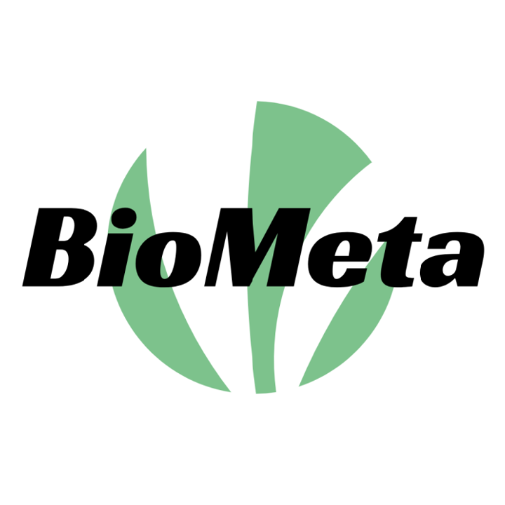

<!-- # BioMeta -->

<div align="center">



<text style="font-size: 30px">Go For BioMeta</text>

二十一世纪是生物科学的世纪，也是互联网与人工智能的时代

[](https://github.com/ParallelLight/BioMeta)
[](https://img.shields.io/tokei/lines/github/ParallelLight/BioMeta)
[](https://img.shields.io/github/last-commit/ParallelLight/BioMeta)

[](https://github.com/ParallelLight)
[](https://www.zhihu.com/people/parallellight)
[](https://blog.csdn.net/weixin_44421798)
[](https://mp.weixin.qq.com/s/DPMcvwlsQyWs8s2YCgHgUg)
[](https://space.bilibili.com/252451772)

</div>

> Welcome to BioMeta!

欢迎访问**BioMeta**！`“Bio”`是生物学的象征，`“Meta”`是元宇宙的象征，我们将两者组合，一来有生物信息学的韵味，二来更是表达科学研究的探索精神。

## BioMeta简介

**BioMeta**的创立灵感来自元宇宙，元宇宙是利用科技手段进行链接创造的与现实世界映射和交互的虚拟世界，具备新型社会体系的数字生活空间。我们希望利用互联网自媒体平台分享生命科学领域特别是生信领域的前沿科研成果，为广大热爱生信的学习者提供力所能及的帮助和学习指南。

## 我们的宗旨

**BioMeta**的宗旨是**以分享促进步，以交流促成长**。生物信息学多学科交叉融合的学科，是一个纷繁复杂但又充满未知与挑战的新兴领域，网站不仅整合了各种实用的生信工具与数据库，还会定时推送我们对领域内论文的学术解读，我们希望能够为大家提供生信最前沿科研成果的同时记录我们的学习与成长。

期待更多的小伙伴一起学习生信。

<div align="center">
    
</div>

<!-- ```pdf
	https://www.biorxiv.org/content/10.1101/2020.07.21.214387v1.full.pdf
``` -->